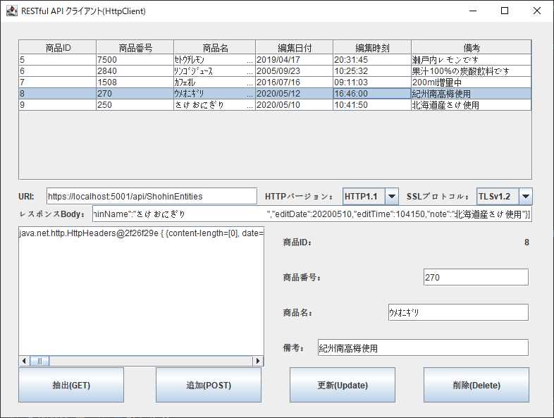
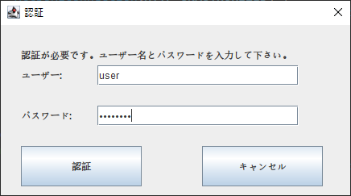

## :computer: JSON形式でHTTPS通信するRESTクライアント(Swing)  
___
### 環境
```
開発環境：Eclipse 2020-06 R(4.16.0) Pleiades  
言語：Java 11  
デスクトップ：Swing
デベロッパーSDK：Adopt OpenJDK 11.0.8  
JSONライブラリー：Jackson 2.11.2  
```

#### 画面イメージ  
  

#### 認証イメージ  
  
___